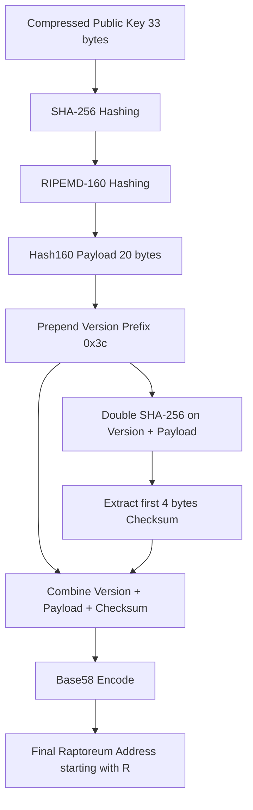

# Raptoreum Multi-Language SDK: Architectural and Cryptographic Whitepaper

This document details the architectural design principles, folder structures, mapping strategies, and cryptographic specifications implemented in the Raptoreum (RTM) Multi-Language SDK.

---

## 1. Executive Summary & Design Philosophy
The Raptoreum Multi-Language SDK provides a standard, robust, and clean interface to the Raptoreum blockchain network across **25 programming languages**. 

The design of the SDK is guided by three core philosophies:
1.  **Zero-Dependency Portability**: To maximize supply-chain security and minimize binary bloat, the SDK packages prioritize native platform capabilities (e.g., standard HTTP libraries, native cryptographic providers) rather than introducing external packages.
2.  **Unification of Interface Casing**: While keeping native syntax styles (e.g., `camelCase` for JavaScript, `snake_case` for Python, `PascalCase` for C#), method names and parameter structures mirror each other perfectly across all languages.
3.  **Strict Security Boundaries**: Rather than relying on nodes for key storage, the SDK provides local cryptographic libraries to generate private keys, derive addresses, and sign messages offline, guaranteeing private keys never leave local client memory.

---

## 2. Cryptographic Specifications

### 2.1 Elliptic Curve & Key Generation
The SDK uses the standard `secp256k1` elliptic curve for key generation and signing.
*   **Curve Parameters**:
    *   Equation: $y^2 = x^3 + 7 \pmod p$
    *   $p = 2^{256} - 2^{32} - 977$
    *   $n = 115792089237316195423570985008687907852837564279074904382605163141518161494337$
*   **Private Key**: A 32-byte cryptographically secure random integer $k$ in the range $[1, n-1]$.
*   **Public Key**: Calculated as $P = k \times G$, where $G$ is the curve base generator point. Public keys are serialized in the **compressed format** to save blockchain bytes:
    *   `0x02` + 32-byte $X$-coordinate (if $Y$-coordinate is even).
    *   `0x03` + 32-byte $X$-coordinate (if $Y$-coordinate is odd).

### 2.2 Address Derivation (Base58Check)
Raptoreum uses Base58Check addresses with a version byte prefix of `0x3c` (60 in decimal), which guarantees derived addresses start with the letter `R`.


### 2.3 Message & Transaction Signing
To prevent transaction malleability, signatures are signed using standard ECDSA over double-SHA256 message hashes and formatted as DER-encoded octet sequences. They are constrained to **low-$S$** values (i.e. $s \le n/2$). If a derived signature contains $s > n/2$, it is transformed to $s = n - s$ before encoding.

---

## 3. Architectural Repository Layout
To maintain cleanliness, all SDK packages reside under the `sdk/` subdirectory, and onboarding guides reside under `docs/`.

```
rtm-sdk/
├── README.md                 # Root onboarding & roadmap
├── SECURITY.md               # Vulnerability disclosures & key handling safety
├── docs/                     # Documentation directory
│   ├── index.md              # Documentation landing hub
│   ├── integration_guide.md  # Node setup, nginx reverse proxy & SSL config
│   ├── api_reference.md      # Unified API method matrix
│   ├── publishing_guide.md   # Deployment workflows for package registries
│   └── whitepaper.md         # This architectural whitepaper
└── sdk/                      # Monorepo client packages
    ├── python/               # Python setup.py & raptoreum.py module
    ├── javascript/           # Node.js package.json ESM/CJS source
    ├── typescript/           # TypeScript source & build declaration
    ├── go/                   # Go modules client & wallet module
    ├── rust/                 # Cargo crate client & wallet module
    ├── cpp/                  # C++ CMake target
    └── ...                   # Other 19 language targets
```

---

## 4. Threat Analysis & Security Model
1.  **RPC Key Eavesdropping**: Exposing standard RPC credentials over the public internet allows attackers to steal node funds. The SDK addresses this by requiring local SSL termination (via Nginx proxy guides) and providing native offline key derivation so private keys are never sent to nodes.
2.  **Replay Attacks**: Double-SHA256 hashing is enforced locally to prevent pre-image tampering and transaction replay.
3.  **Low-Entropy Private Keys**: Key generation utilities bind directly to native secure entropy sources (e.g. `crypto/rand` in Go, `OsRng` in Rust, `os.urandom` in Python, `crypto.generateKeyPairSync` in JS) to block predictability vectors.
